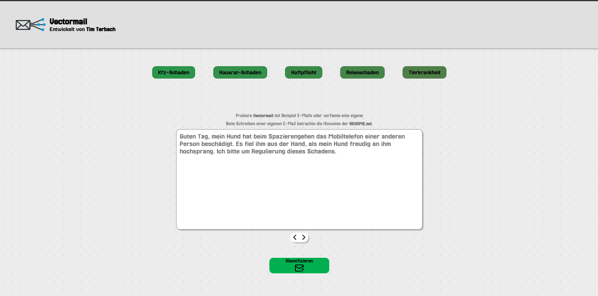

# ectorMail

ectorMail ist ein modulares E-Mail-Klassifizierungssystem mit einer interaktiven Benutzeroberfläche. Das Projekt besteht aus einem modernen Frontend, einem Spring Boot-Backend und einem Python-basierten Klassifizierungsmodul, das in einem Docker-Container läuft. Benutzer können E-Mail-Texte zur Klassifizierung eingeben und Echtzeit-Wahrscheinlichkeiten sowie visuelles Feedback für verschiedene Kategorien beobachten.



---

## Project Structure

```
ectorMail/
├── api/                 # Spring Boot backend (REST API)
├── frontend/            # Vue.js frontend (Vite)
├── python-service/      # Python-based classification module (Flask)
├── docs/                # Theory and implementation details
├── docker-compose.yml   # Launches the Flask engine container
├── README.md            # Project overview
```

---

## Getting Started

To run the full system, follow the steps below:

### 1. Start the Python Engine (Dockerized Flask Server)

Make sure Docker is installed and running, then execute from the root directory:

```bash
docker-compose up --build
```

This starts the Flask-based classification engine in a container on port **5000**.

### 2. Start the Backend (Spring Boot)

Follow the instructions in [`api/README.md`](api/README.md):

```bash
cd api
mvn spring-boot:run
```

The backend will launch on [http://localhost:8080](http://localhost:8080) and acts as a bridge between frontend and engine.

### 3. Start the Frontend (Vue 3 + Vite)

Follow the instructions in [`frontend/README.md`](frontend/README.md):

```bash
cd frontend
npm install
npm run dev
```

The application will be available at [http://localhost:5173](http://localhost:5173) by default.

---

## Features

- Interactive email input interface
- Real-time classification probability display
- Visual feedback for email categories
- REST-based communication architecture
- Clean modular separation between frontend, backend, and engine

---

## Further Documentation

- [`frontend/README.md`](frontend/README.md) – UI setup and features
- [`api/README.md`](api/README.md) – Backend endpoints and setup
- [`python-service/README.md`](python-service/README.md) - Docker setup and unittests (assuming this file will be created or is relevant)
- [`docs/theory.pdf`](docs/theory.pdf) – Describes algorithms and evaluation strategies

---

## Requirements

- Docker + Docker Compose
- Java 17+ and Maven (for backend)
- Node.js 16+ and npm (for frontend)

---

## License

Open-source under the [MIT License](https://opensource.org/licenses/MIT)
```
