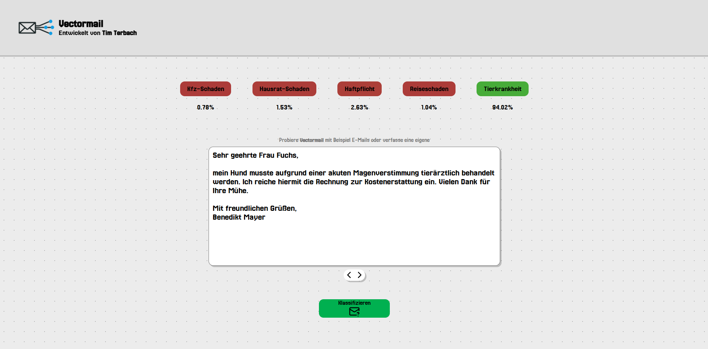

# VectorMail

VectorMail is a modular email classification system featuring an interactive user interface. The project comprises a modern frontend, a Spring Boot backend, and a Python-based classification module running within a Docker container. Users can input email texts for classification and observe real-time probabilities along with visual feedback for various categories.



---

## Project Structure

```
VectorMail/
├── api/                 # Spring Boot backend (REST API)
├── frontend/            # Vue.js frontend (Vite)
├── python-service/      # Python-based classification module (Flask)
├── docs/                # Theory and implementation details
├── docker-compose.yml   # Launches the Fine-Tuned LLM
├── README.md            # Project overview
```

---

## Getting Started

To run the full system, follow the steps below:

### 1. Start the Python Engine (Dockerized Flask Server)

Make sure Docker is installed and running, then execute from the root directory:

```bash
docker-compose up --build
```

This starts the Flask-based classification engine in a container on port **5000**.

### 2. Start the Backend (Spring Boot)

Follow the instructions in [`api/README.md`](api/README.md):

```bash
cd api
mvn spring-boot:run
```

The application will launch on [http://localhost:8080](http://localhost:8080).

### 3. (Optional) Start the Frontend Dev Server (Vue 3 + Vite)

Follow the instructions in [`frontend/README.md`](frontend/README.md):

```bash
cd frontend
npm install
npm run dev
```

The dev server will be available at [http://localhost:5173](http://localhost:5173) by default.

---

## Features

- Interactive email input interface
- Real-time classification probability display
- Visual feedback for email categories
- REST-based communication architecture
- Clean modular separation between frontend, backend, and engine

---

## Further Documentation

- [`frontend/README.md`](frontend/README.md) – UI setup and features
- [`api/README.md`](api/README.md) – Backend endpoints and setup
- [`python-service/README.md`](python-service/README.md) – Docker setup and architecture details
- [`implementation.pdf`](docs/implementation.pdf) – Details technical implementation and architecture
- [`theory.pdf`](docs/theory.pdf) – In-depth theoretical overview of the project's foundation.

---

## Requirements

- Docker + Docker Compose
- Java 17+ and Maven (for backend)
- Node.js 16+ and npm (for frontend)

---

## License

Open-source under the [MIT License](https://opensource.org/licenses/MIT)
```
